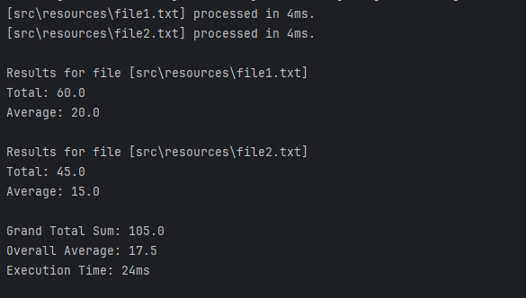

# Multithreaded File Processing and Aggregation

This Java project demonstrates concurrent processing of multiple .txt files using ExecutorService and Callable. Each file contains numerical data (one number per line), and the program calculates per-file and global statistics in a multithreaded fashion.

## Features

- Concurrently reads all .txt files from a given directory.

- Calculates sum and average per file.

- Aggregates results to compute grand total sum and overall average.

- Measures and displays execution time.

- Handles I/O exceptions gracefully.

- Scales efficiently with a large number of files.

## Technologies

- Java 17+

- ExecutorService

- Callable and Future

- java.nio.file for modern file handling

## How It Works

- All .txt files in the specified directory are discovered.

- A fixed thread pool is created (up to 2 threads per CPU core for I/O efficiency).

- Each file is read in a separate thread via a Reader class that implements Callable<List<Double>>.

- The main executor collects all results and:

- Prints the sum and average for each file.

- Calculates and prints the global sum and overall average.

- Measures and prints total execution time.

## Example Input Directory

data/
├── file1.txt  → contains: 10, 20, 30
├── file2.txt  → contains: 5, 15, 25

## Sample Output

## How to Run

- Place .txt files in a folder (e.g., resources/).

- Update your Main.java to call:new FileProcessingExecutor().run("src/resources");

- Compile and run

## Repository
The source code is available on Github:

[Concurrent File Processing](https://github.com/shaghayegh-ghasemi/Java_Code_Lab/tree/main/Java_Multithreading/src/src/com/bounteous/file/processing) 
 

 