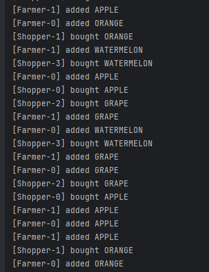

# Fruit Market Simulation (Java)

This Java project simulates a fruit market where farmers produce and deliver fruits to a market, and shoppers (consumers) purchase them. The market handles inventory separately for each fruit type and uses blocking behavior to simulate real-world queuing and waiting.

---

## Concept

- **Farmers** (Producers) generate random fruits and bring them to the market.
- **Shoppers** (Consumers) try to buy specific fruits and wait if they’re out of stock.
- **Market** (Shared Buffer) manages inventory per fruit type using bounded queues.

---

## Components

| Class             | Responsibility                                          |
|------------------|----------------------------------------------------------|
| `Fruit`           | Enum of fruit types (`APPLE`, `ORANGE`, etc.)           |
| `Market`          | Manages separate inventory queues for each fruit        |
| `Farmer`          | Produces fruits and delivers to market (with delay)     |
| `Shopper`         | Attempts to buy a specific fruit repeatedly              |
| `MarketSimulator` | Entry point — launches farmers and shoppers             |

---

## Behavior

- Each fruit has a **maximum inventory capacity** (`5` units).
- If the market is full for a fruit, a farmer **waits** until there's space.
- If a shopper requests a fruit that's unavailable, they **wait** for it to be restocked.
- Both interactions are thread-safe via Java’s `BlockingQueue`.

---

## 🚀 Key Concepts Used

- Thread-safe queues: `ArrayBlockingQueue`
- Multi-threading: `Runnable`, `Thread`
- Enum usage: clean handling of fruit categories
- Producer-Consumer model with real-time blocking behavior

---

## Sample output

---
## Repository
The source code is available on Github:

[Github](https://github.com/shaghayegh-ghasemi/Java_Code_Lab/tree/main/Java_Multithreading/src/src/com/bounteous/market)