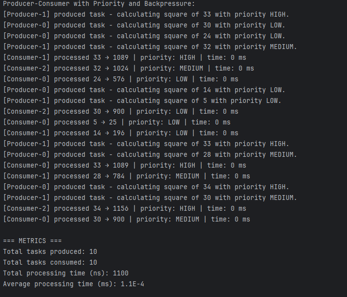

# Producer-Consumer with Priority and Backpressure

This Java project implements a multi-threaded producer-consumer system using a `PriorityBlockingQueue` with task prioritization and graceful shutdown. It simulates real-world scheduling where high-priority tasks are processed before medium and low-priority ones, while supporting backpressure and configurable concurrency.

---

## Features

-  Multiple producers and consumers running in parallel
-  Tasks assigned with `HIGH`, `MEDIUM`, or `LOW` priority
-  Each task performs a simple computation (e.g., squaring a number)
-  Consumers prioritize processing based on task priority
-  Backpressure via `BlockingQueue.put()` (supports bounded queue setups)
-  Graceful shutdown using poison-pill signaling
-  Thread-safe metrics tracking:
    - Number of tasks produced and consumed
    - Total and average processing time

---

## Structure

| File / Class | Description                                           |
|--------------|-------------------------------------------------------|
| `Task`       | Represents a task with priority and logic             |
| `TaskProducer` | Generates random tasks with random priority           |
| `TaskConsumer` | Retrieves and processes tasks, respecting priority    |
| `TaskManager` | Orchestrates thread creation, shutdown, and metrics   |
| `Metric`     | Collects production/consumption counts and timing     |
| `Main`       | Entry point for running the system                    |

---

## Configuration

Set these in `TaskManager`:

```java
new TaskManager(
    2,    // Number of producers
    3,    // Number of consumers
    8,   // Maximum queue size (effective only with LinkedBlockingQueue)
    5     // Number of tasks per producer
).start();
```

---

## Notes on Priority Behavior

- `PriorityBlockingQueue` ensures that **at the moment of polling**, the highest-priority task is returned.
- **Due to concurrency**, tasks may not always be processed in perfect order if consumers act faster than producers.

---

##  Sample Output



## Backpressure Clarification

Java’s `PriorityBlockingQueue` is technically unbounded. While `put()` is used (which blocks in bounded queues), the queue will not actually block unless a custom implementation or semaphore is used.

---

## Repository

Source code is available in Github:

[Github](https://github.com/shaghayegh-ghasemi/Java_Code_Lab/tree/main/Java_Multithreading/src/src/com/bounteous/priority)